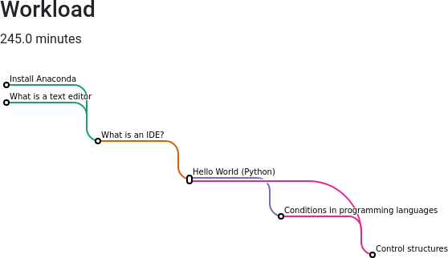
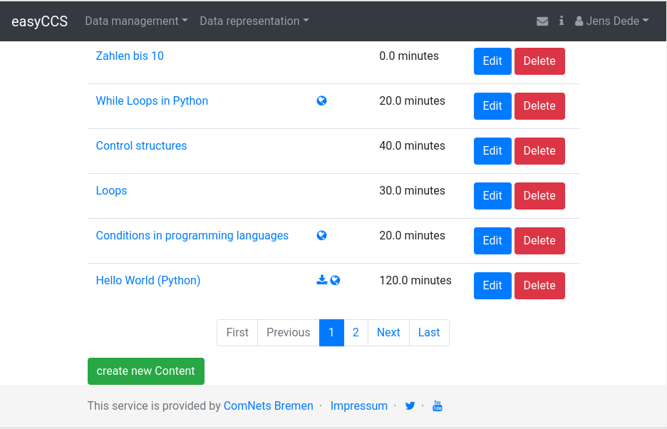
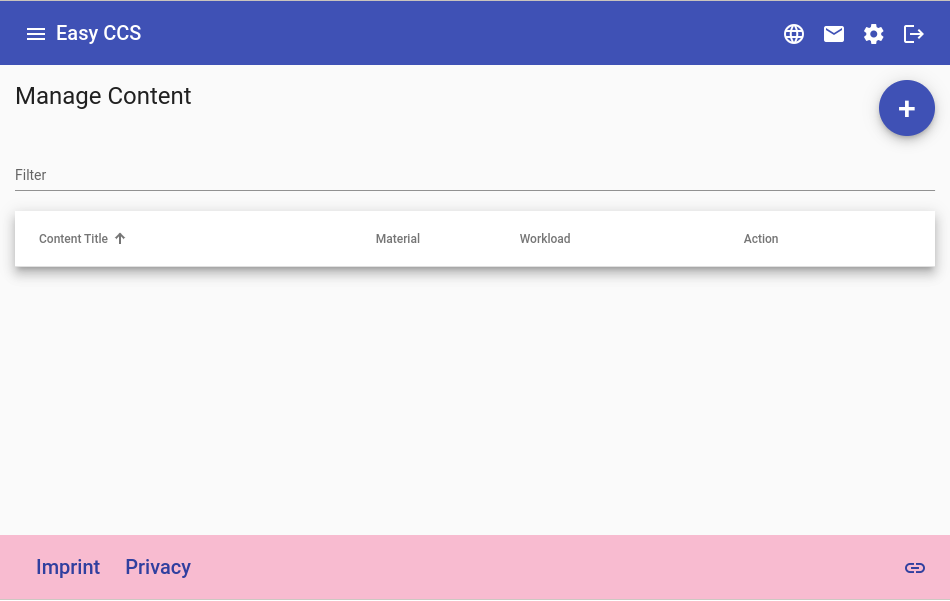

easyCCS - An Easy Content Curation Tool
=======================================

This is the repository for the easyCCS project. This project is developed by
the department of sustainable communication networks, University of Bremen,
Germany.

- [comnets.uni-bremen.de](https://comnets.uni-bremen.de/)
- [ComNets @Twitter](https://twitter.com/ComNetsBremen)
- [ComNets @Youtube](https://www.youtube.com/comnetsbremen)

General Idea
------------

Preparing lectures and dealing with the teaching content can be a hassle.
"*Where is this presentation?*", "*I already created this kind of lecture...*",
"*There was a good video/website for this content. But where?*" are typical
problems. Here, we are trying to offer a solution.

The software in this repository tries to offer a solution for at least

- Managing the lecturing materials: Store everything in a central place
- Tagging the materials: Make it easy to find
- Be exchangeable: Share the content with collogues, friends, the community or
  anybody else. Therefore, the keywords and descriptions should be uniquely
  understandable.
- Show and manage dependencies: Show what a user should know before starting
  with the new content.
- ...

A quick walk-through: What can be done with easyCCS is available on youtube:

Current status
--------------

Even though there is a vast interest in this project, we do not have sufficient
capacity to develop all ideas we have for this project. Hence, we decided to
make this project open source, hoping to find interested people and build a
community around it.

**If you have ideas and would like to contribute: Feel free to contribute and
contact us, start an issue, create a pull request etc.!**

Demo webpage
------------

You can find a demo webpage here:
[easyccs.comnets.uni-bremmen.de](https://easyccs.comnets.uni-bremen.de/content/).
You can request a demo account there.

About the software
==================

The software is written using the [Django
framework](https://www.djangoproject.com/) using Python. Here, a basic web-UI
is available to evaluate the targeted functionality. We are using the following
terms:

- A **Skill** is something a user can achieve from the given content. A content
  module should always offer at least one new skill, i.e., the user should
  learn something from the content. Content can require one or multiple skills
  as a prerequisite.
- **content** is the learning material itself. It can be a set of slides, a
  video, a link to a webpage, a pdf document etc. It can require an "input skill",
  i.e. a skill the user has to know to work on this content successfully. A
  content module should offer at least one new skill to the user. Otherwise,
  the user would not have learned anything new.
- In contrast to content modules, **Exercises** deepen and train the
  understanding of the given modules. They have input skills but do not offer
  new skills.

To achieve interoperability between different users and instances of easyCCS,
we are planning to use [Wikidata](https://www.wikidata.org/) for the keywords
describing the skills. Using Wikidata will have the following advantages

- The Wikidata database contains descriptions for the majority of events,
  concepts or things in the world.
- Everything has a unique identifier
- The description is available in different languages
- The items are connected using relationships
- Everybody can contribute and extend.

Especially the unique identifiers and the translation will help to move the
content of easyCCS to another instance and continue working. Right now, we are
working on the implementation.

Client #1: Web UI
-----------------

We are currently working on two user interfaces for accessing the system. The
first one is the Django generated web UI. It can be accessed directly and does
not require additional setup. Anyhow, the flexibility is missing.

Client #2: Angular PWA
----------------------

Benedikt Caspari developed a demo of an Angular PWA. It offers more
flexibility and options compared to the standard web UI. You can find the new UI in this work's [client](client) subdirectory. The separate [README](client/README.md) describes the setup.

The status of the Angular PWA is "demo": It does not have a connection to the
central part. For that, a REST API has to be implemented on the server side.
Therefore, it can be seen as a UI mockup

Getting everything running (a quick walk-through)
=================================================

The recommended operating system is linux. The following packages are required:

- Django
- Numpy

You can clone this repository via GitHub `git clone https://github.com/ComNets-Bremen/easyCCS.git`

Afterwards, you have to perform the following steps in the subdirectory
`easyCCS`:

- `./manage.py migrate` : Create database
- `./manage.py createsuperuser`: Create the first user

Afterwards, you can start the test server: `./manage.py runserver`. You can now access the user interface on the local machine:
[http://127.0.0.1:8000](http://127.0.0.1:8000)

TODO
====

You can find on the open issues on
[github](https://github.com/ComNets-Bremen/easyCCS/issues)

Security
========

Before using this code on a public server, you should make yourself familiar
with some potential security considerations:

- The `settings.py` contains a secret key. You should not use the one in the
  repository. For each installation, a separate key should be used. You can
  keep it local by adding it to the `settings_local.py`.
- Similar holds for the mail address in the settings: If you want to get usable
  feedback: Please use your own address
- The code is not checked for security. Maybe you should walk through it
  and check if running it on your server is safe.
- Maybe running the system on an isolated server is a good idea?
- Anyhow, we will not take any responsibility for the code and the project.

Publications
============

- [Automatic Content Curation for Online Learning Materials](https://doi.org/10.1145/3408877.3439601)

License
=======

Jens Dede, Sustainable Communication Networks, University of Bremen, jd@comnets.uni-bremen.de, 2022

This code is licensed under the GPLv3. You can find it [here](LICENSE).

Acknowledgements
================

* [Skuriles](https://github.com/Skuriles) for the Angular client mockup
* ...
